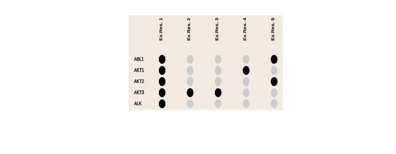

### Cancer Genome Analysis
**Problem Statement** :
> “Over 20 thousand of people die of Cancer everyday"

The main aims of any software to solve real life problems and provide better ways of life. It is a very big problem to solve and make the world a cancer free place. Present cancer analysis methods have the following problems:
 -Diagnosis and analysis of results take a lot of time.
 - Require a research center and a laboratory.
 - Results can not be generalized on a large set of patient data.
 - Genomic Cancer data in a very large amount to analyze for a doctor.

> “Imagine getting survival rate of cancer treatment in seconds instead of days without owning a research lab.”

**Solution**:
We aim to build a powerful tool for cancer, which will distinguish between people who become sick and those remain healthy, between patients who respond to the treatment and those whose condition is worsening, between pathogens that cause outbreaks and those are harmless. Our project would cover the following aspects:
 - Decrease the cost of research and increase the information.
 - Prediction of the patients who responds to the cancer treatments.
 - Forecast the treatment success rate.
 - Prediction of Optimal treatment pathway.

### OncoBlocks
* * *
OncoBlocks is a new open-source initiative, currently hosted at the Biostatistics and Computational Biology Department of the Dana-Farber Cancer Institute, in Boston, MA. The goal of the project is to create reusable, open source software components to support cancer genomics research and enable precision (or "personalized") cancer medicine. These components can then be used and re-used in multiple research and clinical application contexts, and may also form the basis of new features within the cBio Cancer Genomics Portal (http://www.cbioportal.org/), another open-source project, originally created at Memorial Sloan-Kettering Cancer Center.

### Exceptional Responder Initiative
* * *
NCI has embarked on the Exceptional Responders Initiative to understand the molecular underpinnings of exceptional responses to treatment, primarily via chemotherapy. As a proof of principle, there was a search of NCI’s Cancer Therapy Evaluation Program phase II trial database over a period of 10 years (2002-2012) in which about 100 cases were identified as a demonstration that the types of cases needed for the ERI did exist.

### The Team
* * *
I worked under the supervision of Prof. Dr. Ethan Cerami.

Screenshots
* * *
This sections contains the final screen of the project which has been designed.

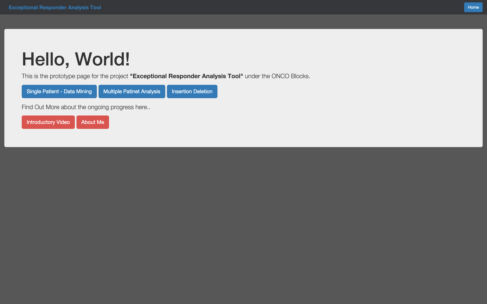

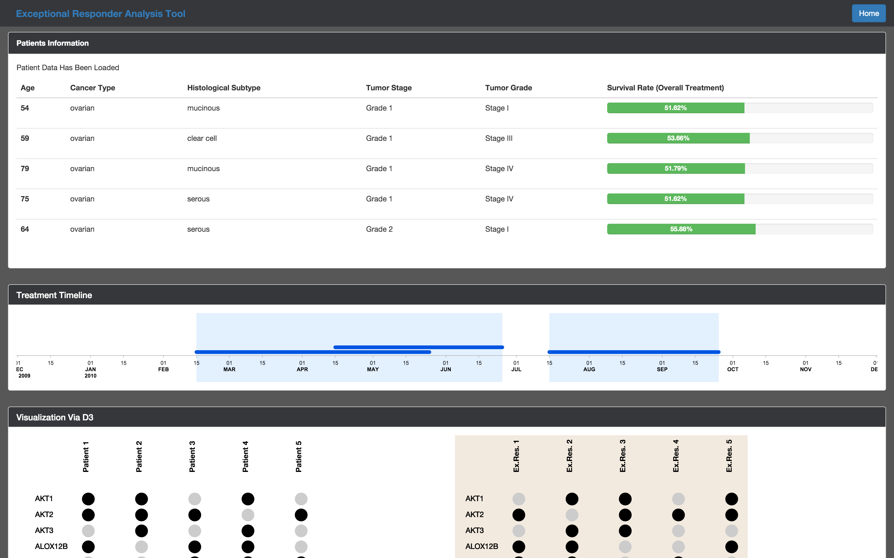

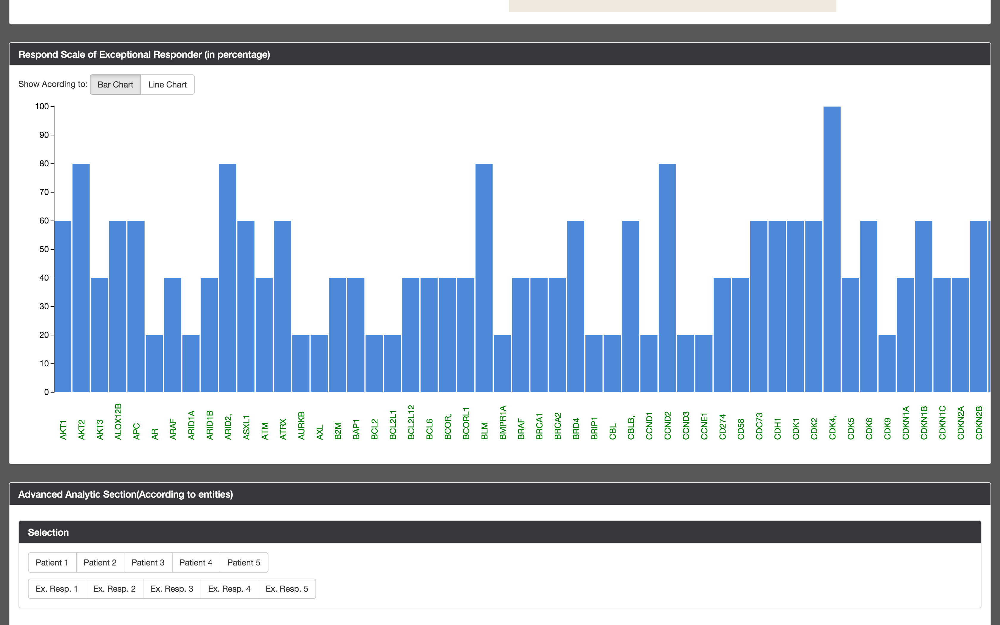

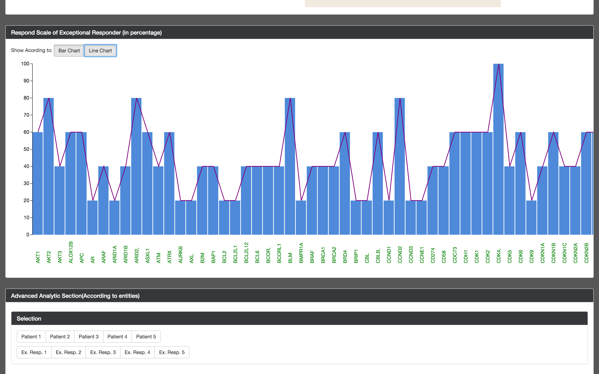

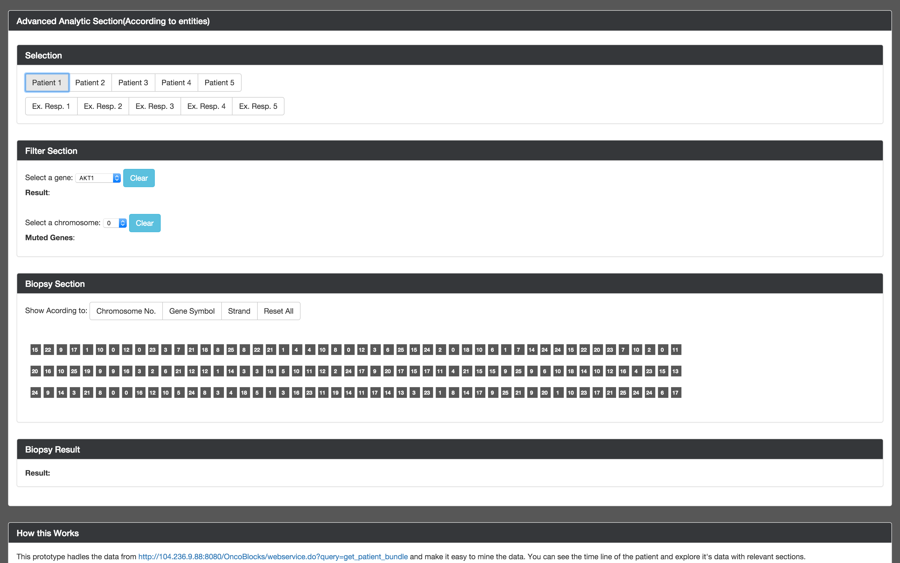

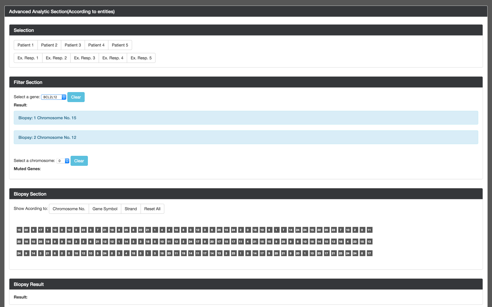

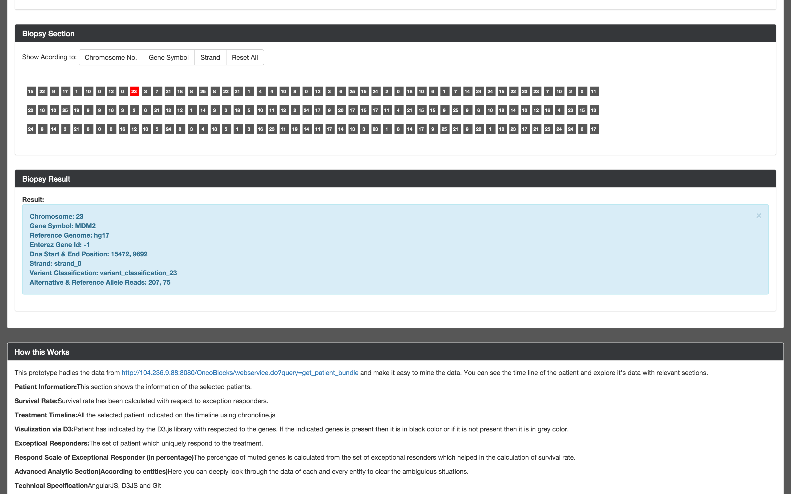

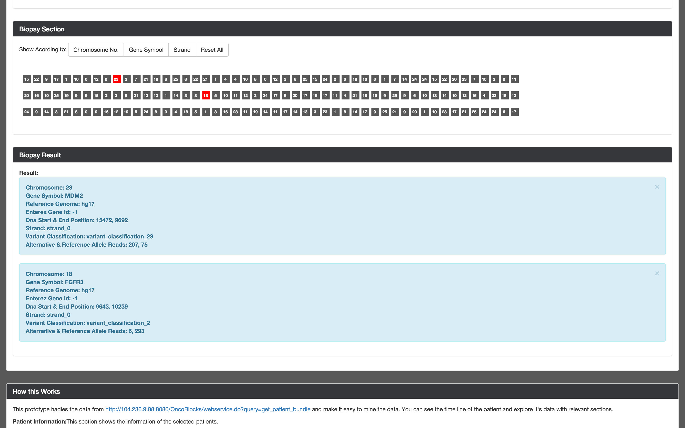

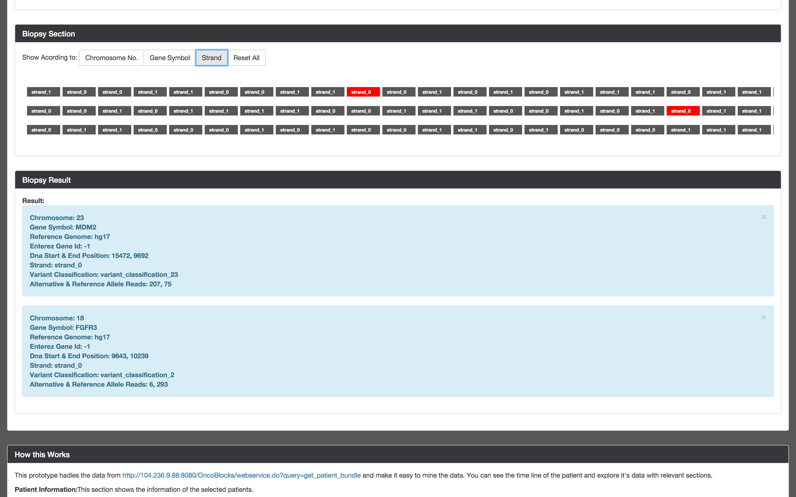

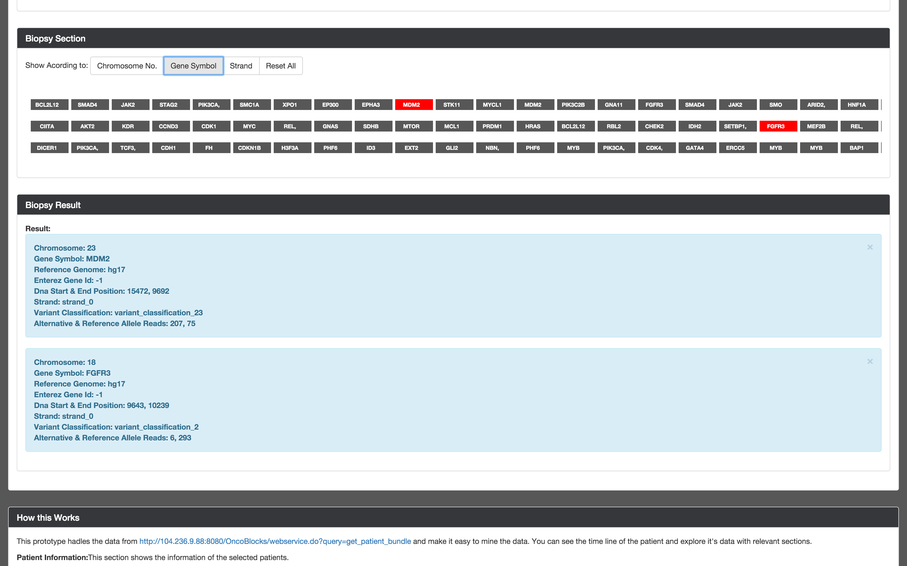

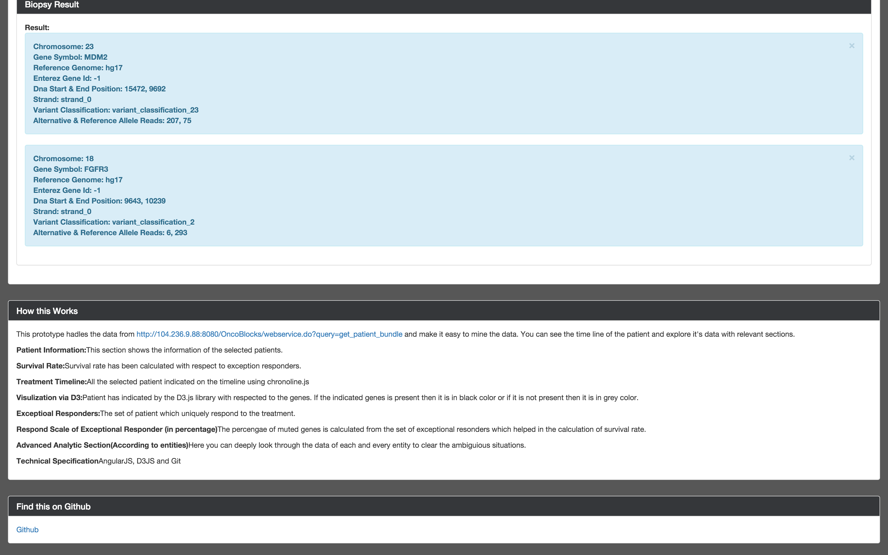

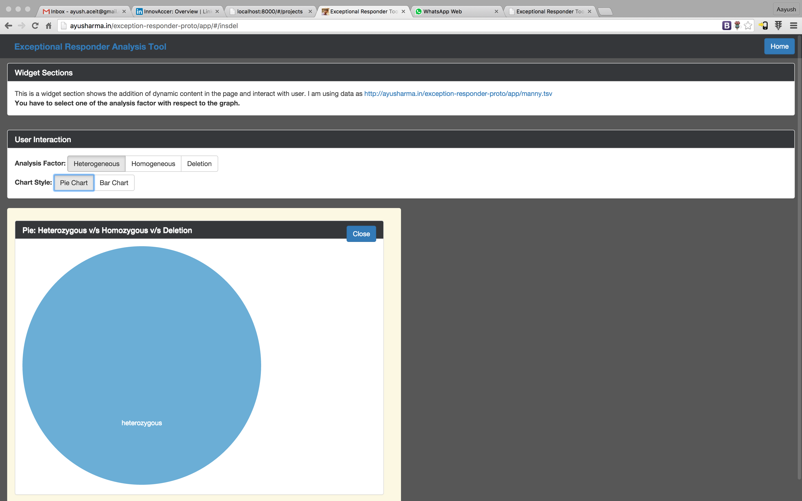

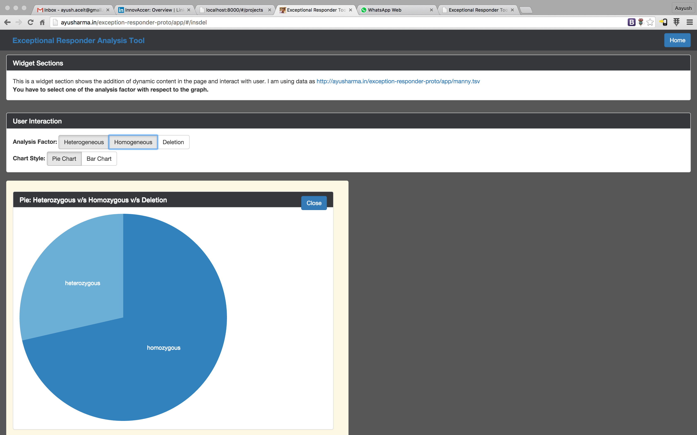

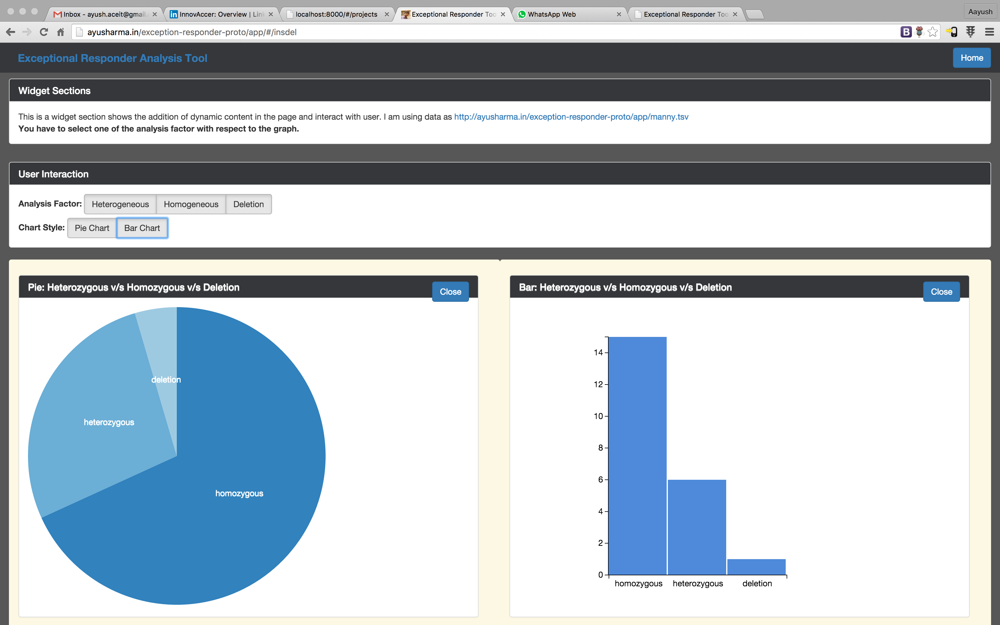

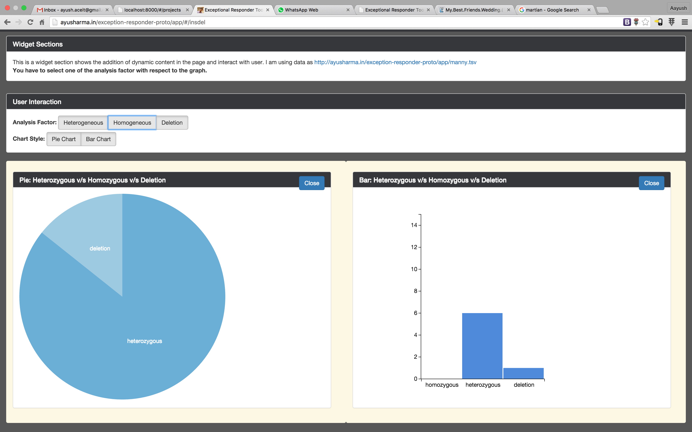

### Features
Project comprised three parts as follows:
 - Single Patient Data Analysis
 - Tool for Single Patient data mining.
 - Representation of Patients with cancer type, stages and time-line.
 - Interactive visualization of Cancer treatment biopsies and data representation.
 - Analysis of biopsies result according to Chromosome Number, strand value and Gene present.
 - Multiple Patient Data Analysis
 - Patient representation with time-line and cancer stages and type.
 - Survival Rate of Patients
 - Respond Scale of Exceptional Responder via visualizations.
 - Provide the advanced analytics.
 - Insertion & Deletion
 - Interactive visualizations of Insertion and Deletion for genetic data.
 - Representation of data in Pie charts or Bar charts.

### Technology Stack
* * *
HTML CSS3 Bootstrap D3 JS Angular JS Ubuntu GIMP

### Learning & Experience
* * *
Bioinformatics projects require a good knowledge of info-graphics and data analytics skill.
 - Learned about info-graphics and data analytics methods..
 - Learned the methods of data visualization using D3.js.
 - Learned about Google Geonomics and other initiatives like BioJS, Global Alliances for Geonomics and Health
 - Cancer, it's stages, type and causes of tumor.
 - DNA, Genes and Protein Synthesis
